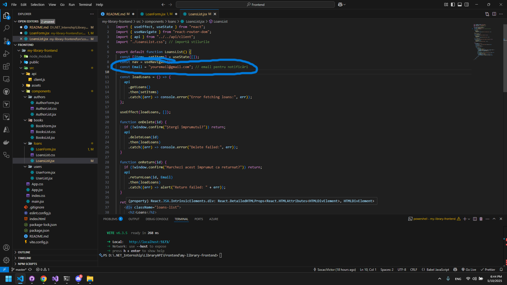
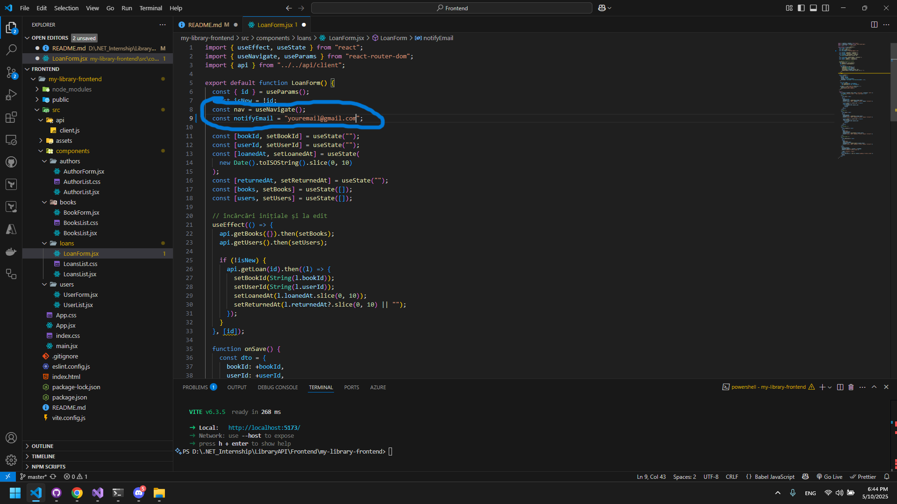

# LibraryAPI – Library Management System

A full-stack application for managing a library’s book collection, built with:

- **Backend**: ASP.NET Core Web API (C#), EF Core, MySQL
- **Frontend**: React + Vite (JavaScript)
- **Extras**: Swagger UI, email notifications via SMTP

---

## 📦 Repository Structure

```
LibraryAPI/
├─ Infrastructure/         # EF Core DbContext & Migrations
├─ Core/                   # Domain models, interfaces, helpers
├─ Services/               # Business logic implementations
├─ Presentation/           # ASP.NET Core Web API project
└─ Frontend/
   └─ my-library-frontend/ # React + Vite frontend
```

---

## 🔧 Prerequisites

- **.NET 7 SDK** (or .NET 6)
- **MySQL Server 8.0+**
- **Node.js v16+** and **npm**
- A valid SMTP account (e.g. Gmail with App Password) for email notifications

---

## 🚀 Setup & Run

### 1. Clone & Configure

```bash
git clone https://github.com/SocaciVictor/LibraryAPI.git
cd LibraryAPI
```

#### Backend Configuration

1. In `Presentation/appsettings.json`, set your MySQL connection string:

   ```jsonc
   "ConnectionStrings": {
     "DefaultConnection": "Server=localhost;Database=library;User=root;Password=your_password;"
   }
   ```

2. Configure SMTP for notifications:

   ```jsonc
   "Smtp": {
     "Host": "smtp.gmail.com",
     "Port": "587",
     "User": "youremail@gmail.com",
     "Pass": "YOUR_APP_PASSWORD",
     "From": "youremail@gmail.com"
   }
   ```

   You need to enable 2-Step-Verification on gmail and you need to create a app passwords to change the value from smtp "Pass". https://myaccount.google.com/apppasswords

### 2. Apply Database Migrations

If you haven’t installed EF tools:

```bash
dotnet tool install --global dotnet-ef
```

Run migrations:

```bash
dotnet ef database update   --project Infrastructure   --startup-project Presentation
```

### 3. Start Backend API

```bash
cd Presentation
dotnet run
```

- The API listens on **https://localhost:7088/**
- Swagger UI: **https://localhost:7088/swagger**

### 4. Start Frontend

```bash
cd Frontend/my-library-frontend
npm install
npm run dev
```

- The React app runs at **http://localhost:5173/**

---

## 🔍 Features

### Authors

- **CRUD**:
  - `GET /api/authors`
  - `GET /api/authors/{id}`
  - `POST /api/authors`
  - `PUT /api/authors/{id}`
  - `DELETE /api/authors/{id}`

### Books

- **CRUD + Search**:
  - `GET /api/books?authorId=&title=&publishedDate=`
  - `GET /api/books/{id}`
  - `POST /api/books`
  - `PUT /api/books/{id}`
  - `DELETE /api/books/{id}`
- **Availability**:

### Users

- **CRUD**:
  - `GET /api/users` … `DELETE /api/users/{id}`

### Loans

- **Borrow**:
  - `POST /api/loans` with `{ bookId, userId }`
- **Return**:
  - `POST /api/loans/{loanId}/return`
- **List & Details**:
  - `GET /api/loans`
  - `GET /api/loans/{id}`
- **Edit Loan**:
  - `PUT /api/loans/{id}` to update book/user/date/return date

### Notifications

- IoC-injected `IEmailSender` sends **X-Notify-Email** header notifications for borrow/return.

---

## 📝 Usage Notes

- **CORS** is enabled for `http://localhost:5173` in `Program.cs`.
- To trigger email notifications, include header:
  ```
  X-Notify-Email: youremail@domain.com
  ```
  on `POST /api/loans` and `POST /api/loans/{id}/return`.

---

## 🛠️ Development Tips

- Use **Swagger UI** for quick API testing.
- Frontend client calls are centralized in `src/api/client.js`.
- Styling and layouts live per-component CSS files under `src/components`.

---

## 7. New Functionality Development

As a new feature, I implemented SMTP email notifications that send messages to the administrator
whenever a new loan is created and whenever a book is returned, keeping the admin informed about
the library’s books.

You need to change the `const Email` to receive those email notifications.



